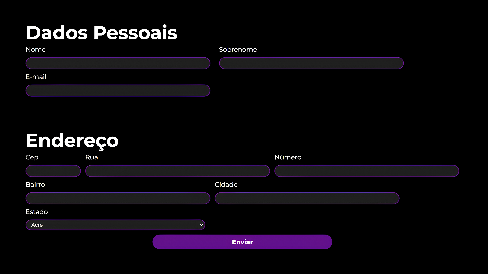

# 📬 Formulário com API

Este projeto é um formulário web que utiliza uma API para consulta de CEPs. Foi desenvolvido com o objetivo de aperfeiçoar conhecimentos em desenvolvimento backend e integração com APIs.

## 📄 Descrição
O formulário permite que o usuário insira dados pessoais e de endereço. Ao inserir um CEP, o formulário consulta a API do ViaCEP para preencher automaticamente os campos de endereço, como rua, bairro, cidade e estado.

## ⚙️ Funcionalidade

- 🔍 Consulta de CEP: Ao inserir um CEP, os campos de endereço são preenchidos automaticamente com os dados retornados pela API do ViaCEP.

## 📚 Aprendizados
Este projeto foi desenvolvido para aprimorar os seguintes conhecimentos:

- 🔗 Integração com APIs utilizando JavaScript.
- 🖼️ Manipulação do DOM.
- 🎨 Estilização de formulários com CSS.
- 🗂️ Estruturação de projetos web.

Os conhecimentos aqui desenvolvidos foram parte do aperfeiçoamento das técnicas usadas no curso "JavaScript - consumindo e tratando dados de uma API" da Alura.